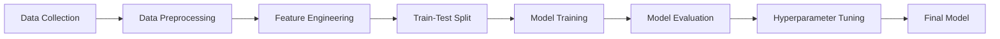

# CodeAlpha_Credit_Scoring_Model

[](https://www.python.org/downloads/)
[](https://scikit-learn.org/)
[](LICENSE)

## 📌 Overview

A machine learning project developed during my internship at **CodeAlpha** to predict an individual's creditworthiness using historical financial data. This credit scoring model uses multiple classification algorithms to assess credit risk and provide accurate predictions.

## 🎯 Objective

To build a robust credit scoring system that can predict whether an individual is creditworthy based on their past financial behavior and demographic information.

## 🔬 Methodology

### Algorithms Implemented:
- **Logistic Regression** - Baseline model
- **Decision Tree Classifier** - Non-linear relationships
- **Random Forest Classifier** - Ensemble method (Best performing)

### Key Features Analyzed:
- Age
- Employment status
- Housing type
- Saving accounts status
- Checking account balance
- Credit amount
- Loan duration
- Purpose of credit

## 📊 Model Performance

| Model | Accuracy | Precision | Recall | F1-Score | ROC-AUC |
|-------|----------|-----------|--------|----------|---------|
| Logistic Regression | 0.49 | 0.50 | 0.58 | 0.54 | 0.46 |
| Decision Tree | 0.53 | 0.53 | 0.65 | 0.58 | 0.53 |
| **Random Forest** | **0.54** | **0.55** | **0.53** | **0.54** | **0.55** |

> **Note**: The Random Forest model showed the best overall performance with balanced metrics.

## 🛠️ Technologies Used

- **Python 3.8+**
- **Libraries**:
  - pandas - Data manipulation
  - numpy - Numerical operations
  - scikit-learn - Machine learning algorithms
  - matplotlib - Data visualization
  - seaborn - Statistical graphics
  - warnings - Error handling

## 📁 Project Structure
```
CodeAlpha_Credit_Scoring_Model/
│
├── Credit_Scoring_Model.ipynb    # Main Jupyter notebook
├── german_credit_data.csv        # Dataset (if applicable)
├── README.md                     # Project documentation
└── requirements.txt              # Python dependencies
```

## 🚀 Getting Started

### Prerequisites
```bash
Python 3.8 or higher
pip package manager
```

### Installation

1. Clone the repository:
```bash
git clone https://github.com/PONNADIAN/CodeAlpha_Credit_Scoring_Model.git
cd CodeAlpha_Credit_Scoring_Model
```

2. Install required packages:
```bash
pip install -r requirements.txt
```

3. Run the Jupyter notebook:
```bash
jupyter notebook Credit_Scoring_Model.ipynb
```

## 📝 Model Workflow


### 1. Data Preprocessing
- Handled missing values (Saving accounts & Checking account)
- Encoded categorical variables
- Feature scaling using StandardScaler

### 2. Feature Engineering
- Created dummy variables for categorical features
- Normalized numerical features
- Handled class imbalance

### 3. Model Training
- Split data: 80% training, 20% testing
- Applied stratified sampling
- Trained three different models

### 4. Evaluation Metrics
- Confusion Matrix
- Classification Report
- ROC Curve Analysis
- Feature Importance Analysis

## 📈 Key Visualizations

### Confusion Matrix
Shows the model's prediction accuracy across different classes.

### ROC Curve
Demonstrates the trade-off between true positive rate and false positive rate.

### Feature Importance
Identifies which features contribute most to credit risk prediction.

### Precision-Recall Curve
Evaluates model performance at different classification thresholds.

## 💡 Key Insights

1. **Credit Amount** and **Duration** are the most important features
2. Random Forest provides the most balanced performance
3. Model achieves ~54% accuracy with balanced precision and recall
4. ROC-AUC score of 0.55 indicates moderate discrimination ability

## 🔮 Future Improvements

- [ ] Implement advanced ensemble methods (XGBoost, LightGBM)
- [ ] Perform extensive hyperparameter tuning using GridSearchCV
- [ ] Add feature selection techniques
- [ ] Implement cross-validation for better generalization
- [ ] Create a web interface using Flask/Streamlit
- [ ] Add model explainability using SHAP values
- [ ] Collect more diverse data for better predictions

## 🎓 Learning Outcomes

Through this project, I gained practical experience in:
- End-to-end ML pipeline development
- Feature engineering techniques
- Model evaluation and comparison
- Handling imbalanced datasets
- Real-world credit risk assessment

## 📜 About CodeAlpha Internship

This project was completed as part of the **CodeAlpha Machine Learning Internship Program**. The internship focused on:
- Hands-on machine learning implementation
- Real-world problem solving
- Model deployment strategies
- Best practices in ML development

### Internship Tasks:
✅ Task 1: Credit Scoring Model (Completed)

## 👨‍💻 Author

**PONNADIAN SA**
- GitHub: [PONNADIAN ](https://github.com/PONNADIAN)
- LinkedIn: [PONNADIAN SA](https://linkedin.com/in/ponnadian-sa-5649a5328)
- Email: upgrademyskill@gmail.com

## 🤝 Contributing

Contributions, issues, and feature requests are welcome! Feel free to check the [issues page](https://github.com/PONNADIAN/CodeAlpha_Credit_Scoring_Model/issues).

## 📄 License

This project is licensed under the MIT License - see the [LICENSE](LICENSE) file for details.

## 🙏 Acknowledgments

- **CodeAlpha** for providing this learning opportunity
- UCI Machine Learning Repository for the German Credit Data
- The open-source community for amazing tools and libraries

## 📞 Contact

For any queries regarding this project, feel free to reach out:
- Create an issue in this repository
- Connect with me on LinkedIn
- Send an email

---

<div align="center">
  
### ⭐ If you found this project helpful, please give it a star!

**Made with ❤️ during CodeAlpha ML Internship**

[🔝 Back to Top](#codealpha_credit_scoring_model)

</div>
